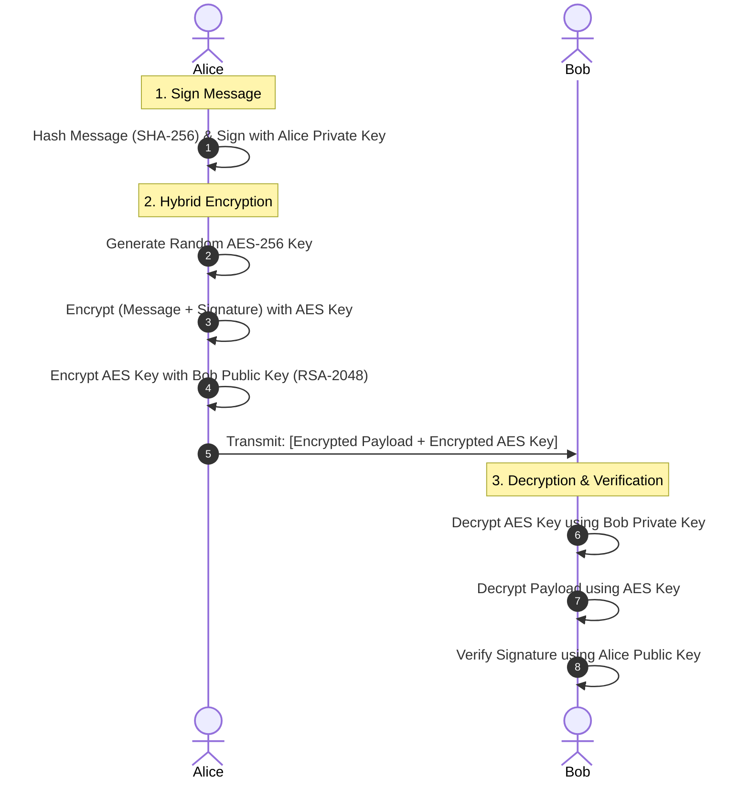

# 🔐 Hybrid Sign-then-Encrypt Cryptographic Protocol

A Python implementation of a secure hybrid cryptographic system demonstrating fundamental building blocks: **Asymmetric Encryption (RSA)**, **Symmetric Encryption (AES-GCM)**, **Cryptographic Hashing (SHA-256)**, and **Digital Signatures (RSA-PSS)**.

Based on concepts from *Applied Cryptography* (Chapter 2: Protocol Building Blocks).

## 🚀 Key Features

- **CSPRNG Key Generation**: Generates 2048-bit RSA keys using system entropy.
- **Digital Signatures**: Signs messages using RSA-PSS with SHA-256 for non-repudiation.
- **Hybrid Encryption**: Combines the speed of AES-256-GCM symmetric encryption with the key-exchange security of RSA-2048-OAEP asymmetric encryption.
- **Tampering Detection**: Simulates a man-in-the-middle (Mallory) attack to prove digital signature verification failures on altered payloads.

## 📐 Protocol Workflow Diagram



## 🛠️ Installation & Setup

1. **Clone the repository:**
   ```bash
   git clone https://github.com/ankurkundu216-del/hybrid-crypto-protocol.git
   cd hybrid-crypto-protocol

2. **Install dependencies**
    ```bash
    pip install -r requirements.txt

3. **Run the Protocol**
    ```bash
    python secure_protocol.py

## 🧪 Expected Terminal Output

```text
🔑 Generating RSA Keypairs for Alice and Bob...
📄 Original Message: Confidential Protocol Building Blocks Data: Launch Code 9982
👀 INSIDE LOOK -> Raw Signature (First 30 bytes): a260a652...
👀 INSIDE LOOK -> Raw 32-byte AES Key: 4a36f1a0...
👀 INSIDE LOOK -> AES Encrypted Payload (Ciphertext): 870b72a4...
🔒 Encrypted Payload (AES-256) & Key (RSA-2048) Ready for Transmission!

📩 Bob received the encrypted package. Processing...
🔓 Decrypted Message: Confidential Protocol Building Blocks Data: Launch Code 9982

😈 MALLORY INTERCEPTS THE DECRYPTED MESSAGE AND ALTERS IT!
🚨 VERIFICATION FAILED: InvalidSignature!
❌ The hash of the tampered message did not match the signature. Tampering detected and stopped!


